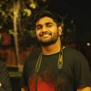

<!--  -->

> ### *“Wisdom is not a product of schooling but of the lifelong attempt to acquire it.”*
> *– Albert Einstein*
---

## *hello*

I'm Aashutosh Trivedi, a data science and machine learning engineer.
If I describe myself in one line - that would be - always eager to learn. I have always introduced myself as a lover of technology, a technophile, a presenter, a leader and an achiever.

As graduate in mechanical engineering from [IIT Jammu](iitjammu.ac.in), I was always inspired to grab each and every possible opportunity thrown at me by life. Had an opportunity to work with an amazing team to create a first all terrain vehicle.  The many hats worn from mechanical engineer to data science enthusiast continue to inspire and feed my curiosity.

## *Journey*

Talking about my journey, it all starts back from my school time. I was always privileged to lead and work with some wonderful team. In class tenth, I was elected house captain of red house, playing an important role in the sports and annual cultural celebration.Adding to this experience, I was appointed the captain of NCC batch during year 2013. I wear many such eperiences that have sculptured my personality and made me who I'm today.

I had been the general secretary of students body, and been an integral part of the Baja team who are proud enough to be called a first third-gen IIT to take part in car design competition within it's second year of establishment.

Apart from it I'm deeply passionate about the new technology and its impact on transforming the society. I have a my interests in the field of machine learning, data analytics and cloud based computing.

Coming on the internships, I interrned with jugaad analytics which is an analytical firm located in Amsterdam which works in the field of predictive maintenance , big data analytics and Stock market prediction. You can read more about it [here](/aashutoshtrivedi.github.io/jugaad/).

Rest of the internships were in mechanical domain, so I'll skip those. I will write about them sometime later in a blog post, as it was something very technical and interesting.
